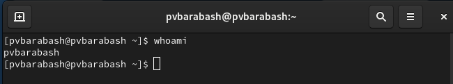
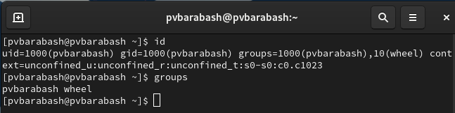
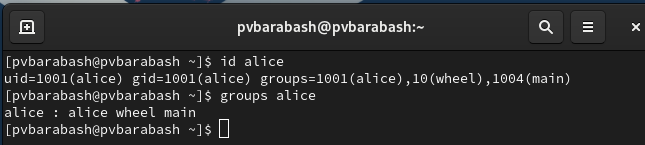
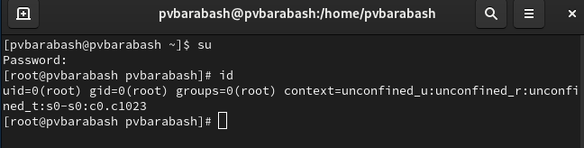
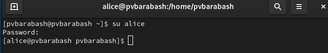
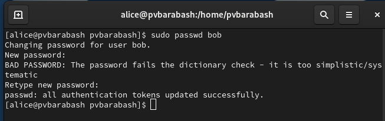
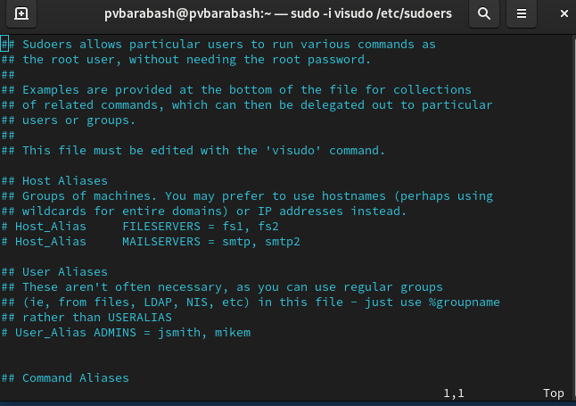
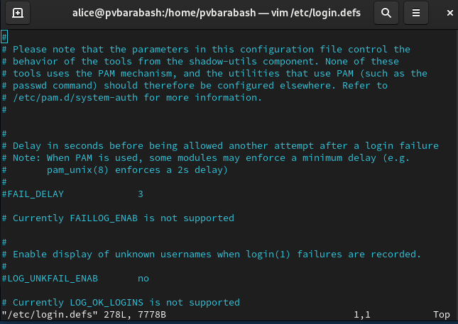

---
## Front matter
lang: ru-RU
title: Презентация по выполнению лабораторной работы 
subtitle: Лабораторная работа №2
author:
  - Барабаш П.В.
institute:
  - Российский университет дружбы народов, Москва, Россия
  
date: 12 сентября 2024

## i18n babel
babel-lang: russian
babel-otherlangs: english

## Formatting pdf
toc: false
toc-title: Содержание
slide_level: 2
aspectratio: 169
section-titles: true
theme: metropolis
header-includes:
 - \metroset{progressbar=frametitle,sectionpage=progressbar,numbering=fraction}
---

# Информация

## Докладчик

:::::::::::::: {.columns align=center}
::: {.column width="70%"}

  * Барабаш Полина Витальевна
  * студентка 2 курса, НПИбд-01-23
  * Российский университет дружбы народов
  * [1132231841@pfur.ru](mailto:1132231841@pfur.ru)

:::
::: {.column width="30%"}

:::
::::::::::::::

## Цели и задачи

- Получить представление о работе с учётными записями пользователей и группами пользователей в операционной системе типа Linux.

# Получение информации о пользователе

## whoami

## id

## groups

# Разница между su и sudo

## su

## sudo

# Файлы для управления пользователями и группами

## Файл /etc/sudoers

## Файл конфигурации /etc/login.defs

## Файл /etc/passwd

имя_пользователя:пароль:UID:GID:комментарий:каталог:оболочка

## Файл /etc/shadow

имя_пользователя:зашифрованный_пароль:последнее_изменение_пароля:минимальное_количество_дней_для_смены_ пароля:максимальное_количество_дней_действительности_пароля:количество_дней_за_которое_появится_предупреждение_о_необходимости_смены пароля:через_сколько_дней_после_истечения_срока_действия_пароля_учётная_запись_будет_отключена:количество_дней_ с_1_января_1970_года_когда_эта_учётная_запись_была_отключена

## Файл /etc/group

название_группы:групповой_пароль:идентификатор_группы_(GID):члены_группы

# Открытие файла в безопасном режиме

visudo и vigr – открывает файл и перед сохранением проверяет синтаксис файла.

# Группа wheel

Wheel — группа администрирования, даёт необходимые права. 

# Выводы

Я получила представление о работе с учётными записями пользователей и группами пользователей в операционной системе типа Linux.
