---
## Front matter
title: "Отчет по выполнению лабораторной работы"
subtitle: "Лабораторная работа №2"
author: "Полина Витальевна Барабаш"

## Generic otions
lang: ru-RU
toc-title: "Содержание"

## Pdf output format
toc: true # Table of contents
toc-depth: 2
lof: true # List of figures
lot: true # List of tables
fontsize: 12pt
linestretch: 1.5
papersize: a4
documentclass: scrreprt
## I18n polyglossia
polyglossia-lang:
  name: russian
  options:
	- spelling=modern
	- babelshorthands=true
polyglossia-otherlangs:
  name: english
## I18n babel
babel-lang: russian
babel-otherlangs: english
## Fonts
mainfont: PT Serif
romanfont: PT Serif
sansfont: PT Sans
monofont: PT Mono
mainfontoptions: Ligatures=TeX
romanfontoptions: Ligatures=TeX
sansfontoptions: Ligatures=TeX,Scale=MatchLowercase
monofontoptions: Scale=MatchLowercase,Scale=0.9
## Biblatex
biblatex: true
biblio-style: "gost-numeric"
biblatexoptions:
  - parentracker=true
  - backend=biber
  - hyperref=auto
  - language=auto
  - autolang=other*
  - citestyle=gost-numeric
## Pandoc-crossref LaTeX customization
figureTitle: "Рис."
tableTitle: "Таблица"
listingTitle: "Листинг"
lofTitle: "Список иллюстраций"
lolTitle: "Листинги"
## Misc options
indent: true
header-includes:
  - \usepackage{indentfirst}
  - \usepackage{float} # keep figures where there are in the text
  - \floatplacement{figure}{H} # keep figures where there are in the text
---

# Цель работы

Получить представление о работе с учётными записями пользователей и группами пользователей в операционной системе типа Linux.

# Выполнение лабораторной работы

**Задание 1.** Прочитайте справочное описание man по командам ls, whoami, id, groups, su, sudo, passwd, vi, visudo, useradd, usermod, userdel, groupadd, groupdel.

Я прочитала справочное описание команд, вводя man + команда (рис. [-@fig:001]).

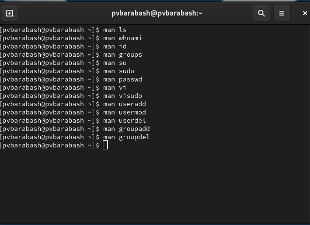{#fig:001 width=70%}

**Задание 2.** Войдите в систему как обычный пользователь и откройте терминал. Определите, какую учётную запись пользователя вы используете, введя команду whoami.

Я вошла в систему как обычный пользователь и ввела команду whoami, которая показала, что ныне я пользователь pvbarabash (рис. [-@fig:002]).

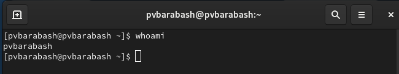{#fig:002 width=70%}

**Задание 3.** Выведите на экран более подробную информацию, используя команду id.

Я вывела на экран более подробную информацию о пользователе с помощью команды id (рис. [-@fig:003]).

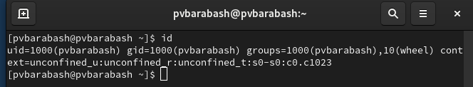{#fig:003 width=70%}

Сначала идет id пользователя — uid, затем id основной группы — gid. Затем информация, в какие ещё группы входит пользователь. Также так как SELinux включен, то id также напечатал контекст безопасности пользователя (context).

**Задание 4.** Используйте команду su для переключения к учётной записи root. При запросе
пароля введите пароль пользователя root. Наберите id.

Я использовала команду su для переключения к учетной записи root. Затем вывела информацию с помощью id. Вывод команды id аналогичен выводу для обычного пользователя (рис. [-@fig:004]).

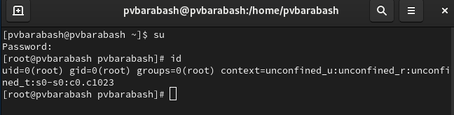{#fig:004 width=70%}

**Задание 5.** Вернитесь к учётной записи своего пользователя.

Чтобы вернуться к учетной записи своего пользователя я набрала команду su pvbarabash (имя пользователя) (рис. [-@fig:005]).

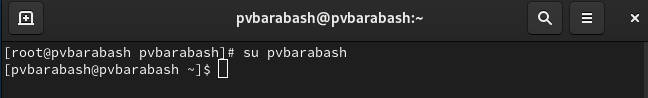{#fig:005 width=70%}

**Задание 6.** Просмотрите в безопасном режиме файл /etc/sudoers, используя, например, sudo -i visudo

Я использовала команду sudo -i visudo, чтобы в безопасном режиме посмотреть файл /etc/sudoers (рис. [-@fig:006]).

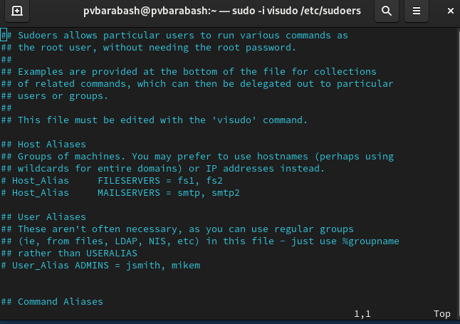{#fig:006 width=70%}

Неправильный синтаксис файла /etc/sudoers может нарушить работу системы и сделать невозможным получение повышенного уровня привилегий, и поэтому очень важно использовать для его редактирования команду visudo.

**Задание 7.** Убедитесь, что в открытом с помощью visudo файле присутствует строка %wheel ALL=(ALL) ALL

Я убедилась, что в открытом с помощью visudo файле присутствует строка %wheel ALL=(ALL) ALL, найдя её (рис. [-@fig:007]).

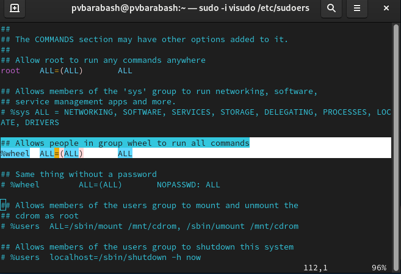{#fig:007 width=70%}

Это строка предоставляет доступ пользователю, находящемуся в группе wheel доступ к sudo. Wheel — группа администрирования, даёт необходимые права. Имеет доступ к файлам журнала и принтерам в CUPS. Также позволяет работать с утилитами sudo и su (по умолчанию их не использует). 

**Задание 8.** Создайте пользователя alice, входящего в группу wheel.

Я создала пользователя alice, используя команду sudo -i useradd -G wheel alice (рис. [-@fig:008]).

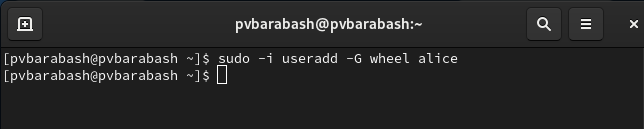{#fig:008 width=70%}

**Задание 9.** Убедитесь, что пользователь alice добавлен в группу wheel.

Я убедилась, что пользователь alice добавлен в группу wheel, введя команду id alice (рис. [-@fig:009]).

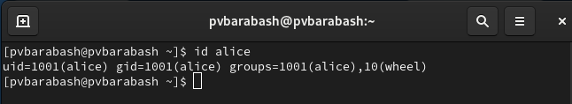{#fig:009 width=70%}

**Задание 10.** Задайте пароль для пользователя alice.

Я задала пароль для пользователя alice, введя команду sudo -i passwd alice (рис. [-@fig:010]).

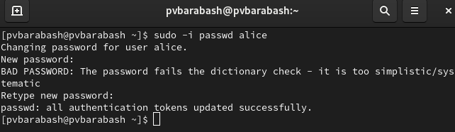{#fig:010 width=70%}

**Задание 11.** Переключитесь на учётную запись пользователя alice.

Я переключилась на учетную запись пользователя alice с помощью команды su alice (рис. [-@fig:011]).

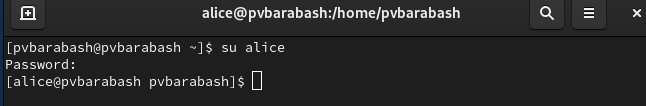{#fig:011 width=70%}

**Задание 12.** Создайте пользователя bob.

Я создала пользователя bob, используя команду sudo useradd bob (рис. [-@fig:012]).

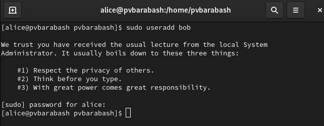{#fig:012 width=70%}

И проверила, что пользователь bob создан, выведя информацию о нем (рис. [-@fig:013]).

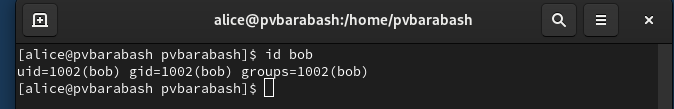{#fig:013 width=70%}

**Задание 13.** Установите пароль для пользователя bob.

Я установила пароль для пользователя bob, используя команду sudo passwd bob (рис. [-@fig:014]).

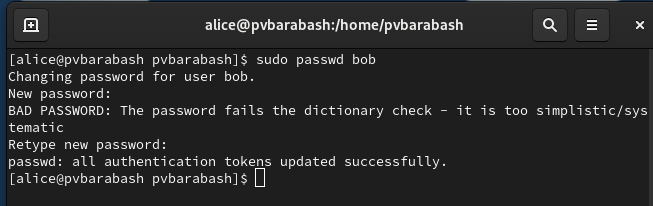{#fig:014 width=70%}

**Задание 14.** Просмотрите, в какие группы входит пользователь bob.

Я ввела команду id bob, чтобы узнать, в какие группы входит пользователь bob (рис. [-@fig:015]).

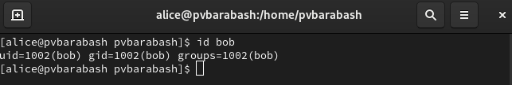{#fig:015 width=70%}

**Задание 15.** Переключитесь в терминале на учётную запись пользователя root.

Я переключилась на учетную запись пользователя root, с помощью команды su (рис. [-@fig:016]).

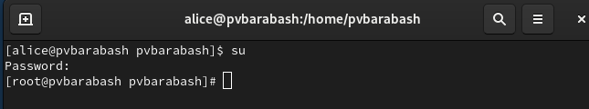{#fig:016 width=70%}

**Задание 16.** Откройте файл конфигурации /etc/login.defs для редактирования, используя, например, vim.

Я открыла файл конфигурации /etc/login.defs для редактирования, используя vim (рис. [-@fig:017]).

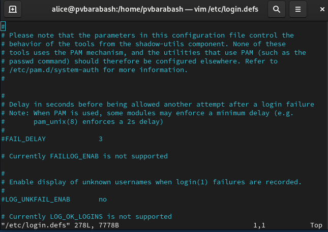{#fig:017 width=70%}

**Задание 17.** Найдите параметр CREATE_HOME и убедитесь, что он установлен в значение yes.

Я нашла параметр CREATE_HOME и убедилась, что он установлен в значение yes (рис. [-@fig:018]).

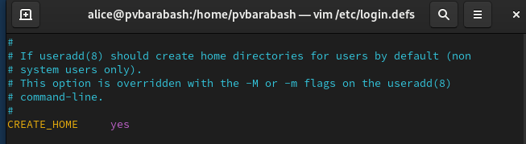{#fig:018 width=70%}

**Задание 18.** Также установите параметр USERGROUPS_ENAB no.

Я вошла в режим редактирования с помощью команды ctrl + i и изменила значение параметра USERGROUPS_ENAB на no (рис. [-@fig:019]).

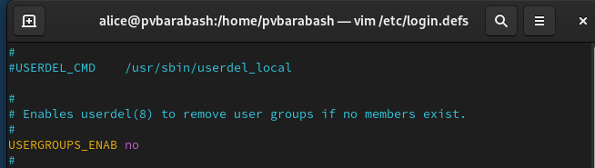{#fig:019 width=70%}

**Задание 19.** Перейдите в каталог /etc/skel. Создайте каталоги Pictures и Documents.

Я перешла в каталог /etc/skel, используя команду cd /etc/skel. Затем создала каталоги, используя команду mkdir (рис. [-@fig:020]).

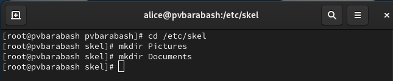{#fig:020 width=70%}

**Задание 20.** Измените содержимое файла .bashrc, добавив строку export EDITOR=/usr/bin/vim

Я нашла файл, открыла его в vim, зашла в режим редактирования и добавила нужную строку (рис. [-@fig:021]).

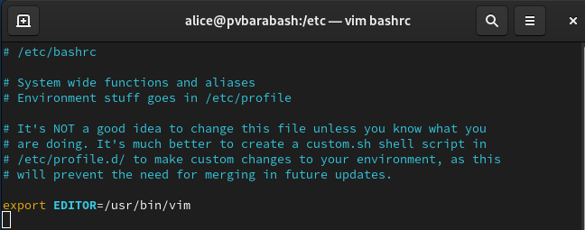{#fig:021 width=70%}

**Задание 21.** Переключитесь в терминале на учётную запись пользователя alice. Используя утилиту useradd, создайте пользователя carol.

Я переключилась на учетную запись alice, введя в терминале команду su alice, а затем создала пользователя carol (рис. [-@fig:022]).

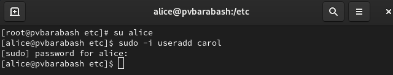{#fig:022 width=70%}

**Задание 22.** Установите пароль для пользователя carol.

Я установила пароль для пользователя carol, введя команду sudo passwd carol (рис. [-@fig:023]).

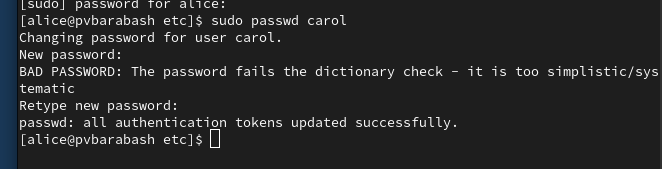{#fig:023 width=70%}

**Задание 23.** Посмотрите и прокомментируйте информацию о пользователе carol, проверьте, в какую первоначальную группу входит пользователь carol; также убедитесь, что каталоги Pictures и Documents были созданы в домашнем каталоге пользователя carol.
 
Я перешла на пользователя carol, используя команду su carol, затем я вывела информацию о пользователе с помощью команды id. Как можно видеть, основная группа этого пользователя — users. Затем я ввела команду cd, а за ней ls -Al и убедилась, что каталоги Pictures и Documents были созданы в домашнем каталоге пользователя carol (рис. [-@fig:024]).

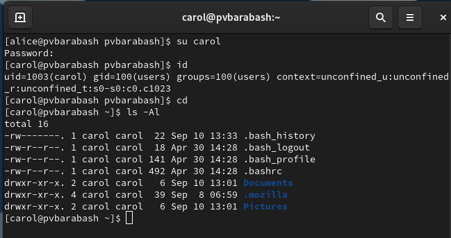{#fig:024 width=70%}

**Задание 24.** Переключитесь в терминале на учётную запись пользователя alice. Поясните в отчёте строку записи о пароле пользователя carol в файле /etc/shadow

Я снова переключилась на пользователя alice, введя команду su alice. Затем я ввела команду sudo cat /etc/shadow | grep carol (рис. [-@fig:025]).

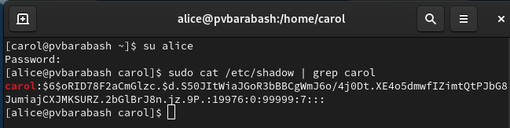{#fig:025 width=70%}

Файл /etc/shadow предназначен для хранения зашифрованных паролей пользователей системы. В файле /etc/shadow определены следующие поля:

1. Имя пользователя. 

2. Зашифрованный пароль

3. Количество дней с 1 января 1970 года, когда пароль был изменён в последний раз.

4. Количество дней до того, как пароль может быть изменён. 

5. Количество дней, после которых необходимо изменить пароль. 

6. За сколько дней до истечения срока действия пароля пользователь получает предупре-
ждение. 

7. Через сколько дней после истечения срока действия пароля учётная запись будет отключена. После истечения срока действия пароля пользователи больше не смогут входить в систему.

8. Количество дней с 1 января 1970 года, когда эта учётная запись была отключена. 

9. Зарезервированное поле, которое добавлено для будущего использования.

**Задание 25.** Измените свойства пароля пользователя carol следующим образом: sudo passwd -n 30 -w 3 -x 90 carol.

Я изменила свойства пароля пользователя carol так, как было указано (рис. [-@fig:026]).

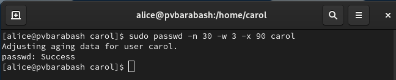{#fig:026 width=70%}

**Задание 26.** Убедитесь в изменении в строке с данными о пароле пользователя carol в файле /etc/shadow.

Я ввела команду sudo cat /etc/shadow | grep carol и убедилась, что в месте записей о сроках изменилась информация (рис. [-@fig:027]).

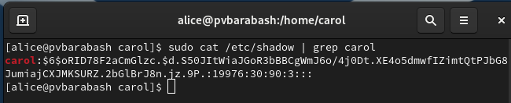{#fig:027 width=70%}

**Задание 27.** Убедитесь, что идентификатор alice существует во всех трёх файлах.

Я ввела команду sudo grep alice /etc/passwd /etc/shadow /etc/group и убедилась, что запись об alice существует во всех трех файлах (рис. [-@fig:028]).

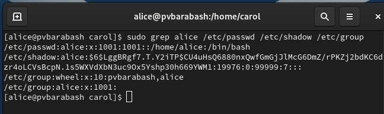{#fig:028 width=70%}

**Задание 28.** Убедитесь, что идентификатор carol существует не во всех трёх файлах.

Я ввела команду аналогичную той, что вводила для alice, только для carol и убедилась, что информация об этом пользователе также существует во всех трех файлах (рис. [-@fig:029]).

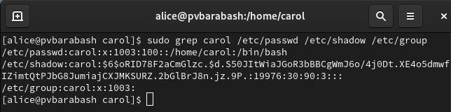{#fig:029 width=70%}

**Задание 29.** Находясь под учётной записью пользователя alice, создайте группы main и third.

Я ввела команды sudo groupadd main и sudo groupadd third, чтобы создать группы (рис. [-@fig:030]).

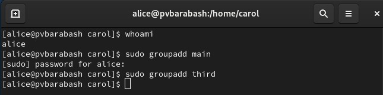{#fig:030 width=70%}

**Задание 30.** Используйте usermod для добавления пользователей alice и bob в группу main, а carol — в группу third.

Я использовала команду sudo usermod -aG <название группы> <имя пользователя>, чтобы добавить пользователей в нужную группу (рис. [-@fig:031]).

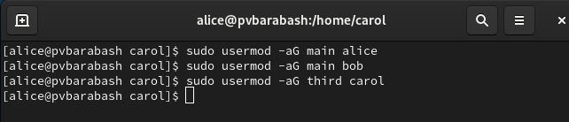{#fig:031 width=70%}

**Задание 31.** Убедитесь, что пользователь carol правильно добавлен в группу third.

Я ввела команду id carol, чтобы убедиться, что этот пользователь добавлен в группу third. Как можно видеть на изображении основная группа carol — users, также carol входит в группу third (рис. [-@fig:032]).

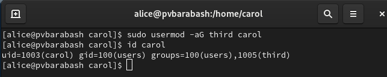{#fig:032 width=70%}

**Задание 32.** Определите, участниками каких групп являются другие созданные вами пользователи

Я использовала команду команды id <имя пользователя>, чтобы посмотреть, в какие группы входят пользователи alice и bob (рис. [-@fig:033] и рис. [-@fig:034]).

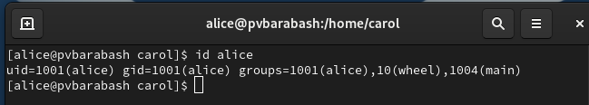{#fig:033 width=70%}

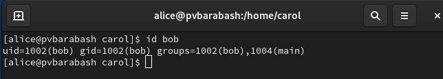{#fig:034 width=70%}

Как можно видеть, alice входит в группы alice, wheel и main, а bob в bob и main.

# Ответы на контрольные вопросы

1. При помощи каких команд можно получить информацию о номере (идентификаторе), назначенном пользователю Linux, о группах, в которые включён пользователь?

Эту информацию можно узнать, используя команду id + имя пользователя (или просто id, если мы являемся интересующим нас пользователем). Эта команда выводит и информацию о идентификаторе пользователя (UID) и информацию о группах, в которые он входит (см. задание 3).

2. Какой UID имеет пользователь root? При помощи какой команды можно узнать UID пользователя? Приведите примеры.

Пользователь root имеет UID 0, это можно видеть на скриншоте задания 4. Для этого нужно ввести команду id + имя пользователя (см. задания 3, 12, 23).

3. В чём состоит различие между командами su и sudo?

- su (substitute user) позволяет переключиться на другого пользователя (по умолчанию root) и требует ввода пароля этого пользователя.

- sudo (superuser do) позволяет выполнять команды от имени суперпользователя или другого пользователя, при этом используется пароль текущего пользователя, если он имеет соответствующие права.

4. В каком конфигурационном файле определяются параметры sudo?

Параметры sudo определяются в файле /etc/sudoers.

5. Какую команду следует использовать для безопасного изменения конфигурации sudo?

Для безопасного изменения конфигурации sudo следует использовать команду visudo. Эта команда открывает файл sudoers в редакторе, который проверяет синтаксис перед сохранением.

6. Если вы хотите предоставить пользователю доступ ко всем командам администрирования системы через sudo, членом какой группы он должен быть?

Чтобы предоставить пользователю доступ ко всем командам администрирования системы через sudo, он должен быть членом группы wheel.

7. Какие файлы/каталоги можно использовать для определения параметров, которые будут использоваться при создании учётных записей пользователей? Приведите примеры настроек.

 Основные файлы:
 
  - /etc/passwd — содержит информацию о пользователях.
  
  - /etc/shadow — хранит зашифрованные пароли пользователей и информацию о сроках действия паролей.
  
  - /etc/group — содержит информацию о группах пользователей.
  
Примеры настроек: в /etc/login.defs можно задать параметры CREATE_HOME и USERGROUPS_ENAB, это мы делали в заданиях 17 и 18.

8. Где хранится информация о первичной и дополнительных группах пользователей ОС типа Linux? В отчёте приведите пояснение таких записей для пользователя alice.

Информация о первичной и дополнительных группах пользователей хранится в файле /etc/group.

На рисунке (рис. [-@fig:028]) последние две записи являются записями в файле /etc/group для alice, как можно видеть, она входит в две группы (на момент этого задания). Также там выводится информация о других пользователях, входящих в эту группу.

9. Какие команды вы можете использовать для изменения информации о пароле пользователя (например о сроке действия пароля)?

Например, можно использовать команду sudo passwd -n 30 -w 3 -x 90 carol (задание 25).

10. Какую команду следует использовать для прямого изменения информации в файле /etc/group и почему?

Для безопасного изменения информации в файле /etc/group следует использовать команду vigr -s /etc/group. Эта команда открывает файл в редакторе с проверкой синтаксиса, чтобы избежать ошибок, которые могут привести к сбоям в системе.

# Выводы

Я получила представление о работе с учётными записями пользователей и группами пользователей в операционной системе типа Linux.
