---
## Front matter
lang: ru-RU
title: Презентация по выполнению лабораторной работы 
subtitle: Лабораторная работа №3
author:
  - Барабаш П.В.
institute:
  - Российский университет дружбы народов, Москва, Россия
  
date: 18 сентября 2024

## i18n babel
babel-lang: russian
babel-otherlangs: english

## Formatting pdf
toc: false
toc-title: Содержание
slide_level: 2
aspectratio: 169
section-titles: true
theme: metropolis
header-includes:
 - \metroset{progressbar=frametitle,sectionpage=progressbar,numbering=fraction}
---

# Информация

## Докладчик

:::::::::::::: {.columns align=center}
::: {.column width="70%"}

  * Барабаш Полина Витальевна
  * студентка 2 курса, НПИбд-01-23
  * Российский университет дружбы народов
  * [1132231841@pfur.ru](mailto:1132231841@pfur.ru)

:::
::: {.column width="30%"}

:::
::::::::::::::

## Цели и задачи

- Получение навыков настройки базовых и специальных прав доступа для групп пользователей в операционной системе типа Linux.

## Смена группы-владельца каталога

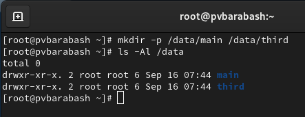

## Смена группы-владельца каталога

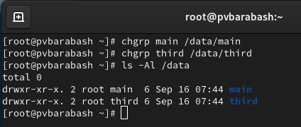

## Установка разрешений 

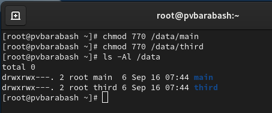

## Установка разрешений

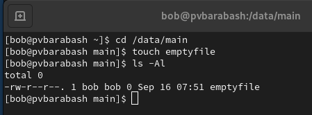

## Установка разрешений

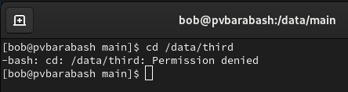

## Удаление файлов другими пользователями

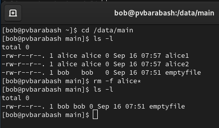

## Установка бита идентификатора группы и stiky-бита для разделяемого (общего) каталога группы

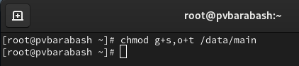

## Что дает бит идентификатора группы

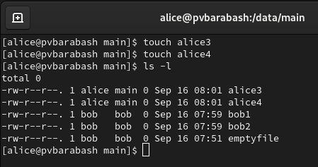

## Что дает stiky-бит для разделяемого (общего) каталога группы

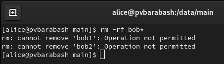

##  ACL - списки контроля доступа

- **setfacl** используется для назначения, модификации и удаления ACL прав.
- **getfacl** используется для просмотра установленных ACL.

##  ACL для доступа 

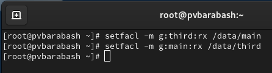

## ACL по умолчанию

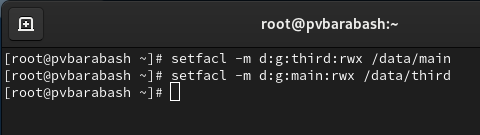

## ACL созданного файла при ACL для доступа

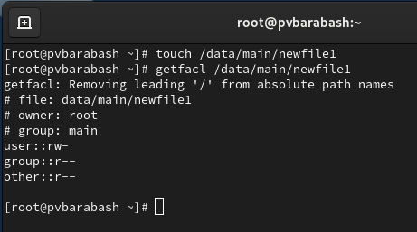

## ACL созданного файла при ACL по умолчанию

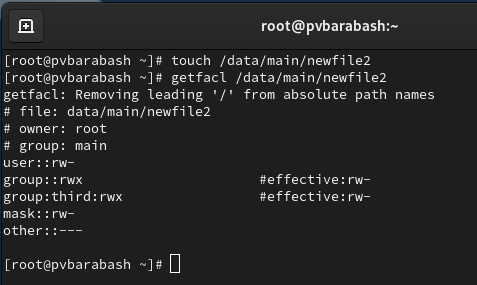

# Выводы

Я получила навыки настройки базовых и специальных прав доступа для групп пользователей в операционной системе типа Linux.
