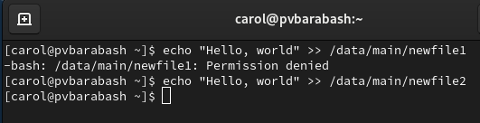

---
## Front matter
title: "Отчет по выполнению лабораторной работы"
subtitle: "Лабораторная работа №3"
author: "Полина Витальевна Барабаш"

## Generic otions
lang: ru-RU
toc-title: "Содержание"

## Pdf output format
toc: true # Table of contents
toc-depth: 2
lof: true # List of figures
lot: true # List of tables
fontsize: 12pt
linestretch: 1.5
papersize: a4
documentclass: scrreprt
## I18n polyglossia
polyglossia-lang:
  name: russian
  options:
	- spelling=modern
	- babelshorthands=true
polyglossia-otherlangs:
  name: english
## I18n babel
babel-lang: russian
babel-otherlangs: english
## Fonts
mainfont: PT Serif
romanfont: PT Serif
sansfont: PT Sans
monofont: PT Mono
mainfontoptions: Ligatures=TeX
romanfontoptions: Ligatures=TeX
sansfontoptions: Ligatures=TeX,Scale=MatchLowercase
monofontoptions: Scale=MatchLowercase,Scale=0.9
## Biblatex
biblatex: true
biblio-style: "gost-numeric"
biblatexoptions:
  - parentracker=true
  - backend=biber
  - hyperref=auto
  - language=auto
  - autolang=other*
  - citestyle=gost-numeric
## Pandoc-crossref LaTeX customization
figureTitle: "Рис."
tableTitle: "Таблица"
listingTitle: "Листинг"
lofTitle: "Список иллюстраций"
lolTitle: "Листинги"
## Misc options
indent: true
header-includes:
  - \usepackage{indentfirst}
  - \usepackage{float} # keep figures where there are in the text
  - \floatplacement{figure}{H} # keep figures where there are in the text
---

# Цель работы

Получение навыков настройки базовых и специальных прав доступа для групп пользователей в операционной системе типа Linux.

# Выполнение лабораторной работы

**Задание 1.** Прочитайте справочное описание man по командам chgrp, chmod, getfacl, setfacl.

Я прочитала справочное описание команд, вводя man + команда (рис. [-@fig:001]).

{#fig:001 width=70%}

**Задание 2.** Откройте терминал с учётной записью root.

Я ввела команду su - и перешла в учетную запись root (рис. [-@fig:002]).

{#fig:002 width=70%}

**Задание 3.** В корневом каталоге создайте каталоги /data/main и /data/third. Посмотрите, кто является владельцем этих каталогов.

Я ввела команду mkdir -p /data/main /data/third, чтобы создать два каталога. А затем командой ls -Al /data вывела информацию о владельцах этих каталогов (рис. [-@fig:003]).

{#fig:003 width=70%}

**Задание 4.** Прежде чем устанавливать разрешения, измените владельцев этих каталогов с root на main и third соответственно. Посмотрите, кто теперь является владельцем этих каталогов.

Я изменила владельцев каталогов с помощью команды chgrp. Затем проверила, что теперь действительно владельцами являются main и third соответственно с помощью той же команды ls -Al /data (рис. [-@fig:004]).

{#fig:004 width=70%}

**Задание 5.** Установите разрешения, позволяющие владельцам каталогов записывать файлы в эти каталоги и запрещающие доступ к содержимому каталогов всем другим пользователям и группам.

С помощью команды chmod 770 я установила нужные разрешения и проверила, что разрешения установлены верные с помощью все той же команды ls -Al /data (рис. [-@fig:005]).

{#fig:005 width=70%}

**Задание 6.** В другом терминале перейдите под учётную запись пользователя bob.

Я использовала команду su - bob, чтобы войти под учетную запись пользователя bob (рис. [-@fig:006]).

{#fig:006 width=70%}

**Задание 7.** Под пользователем bob попробуйте перейти в каталог /data/main и создать файл emptyfile в этом каталоге

Под пользователем bob я перешла в каталог /data/main с помощью команды cd и с помощью команды touch создала файл emptyfile (рис. [-@fig:007]).

{#fig:007 width=70%}

Это возможно, так как bob входит в группу main, а мы установили разрешения, позволяющие владельцем каталогов записывать файлы в эти каталоги в задании 5. 

**Задание 8.** Под пользователем bob попробуйте перейти в каталог /data/third и создать файл emptyfile в этом каталоге.

Я попробовала перейти в каталог /data/third и получила информацию, что данное действие запрещено (рис. [-@fig:008]).

{#fig:008 width=70%}

Это произошло, так как bob не входит в группу third, которая является владельцем данного каталога. А в задании 5, мы установили разрешение, запрещающее доступ к содержимому каталогов всем другим пользователям и группам, кроме владельца.

**Задание 9.** Откройте новый терминал под пользователем alice. Перейдите в каталог /data/main. Создайте два файла, владельцем которых является alice.

Я открыла новый терминал и вошла в учетную запись alice с помощью su - alice. Затем я перешла в каталог /data/main с помощью команды cd и с помощью команды touch создала два файла alice1 и alice2 (рис. [-@fig:009]).

{#fig:009 width=70%}

**Задание 10.** В другом терминале перейдите под учётную запись пользователя bob. Перейдите в каталог /data/main и в этом каталоге введите ls -l. Попробуйте удалить файлы, принадлежащие пользователю alice. Убедитесь, что файлы будут удалены пользователем bob.

В другом терминале я перешла под учетную запись пользователя bob. Перешла в каталог /data/main с помощью команды cd и ввела ls -l, что позволило мне убедиться, что файлы alice видны и пользователю bob. Затем я использовала команду rm -f alice*, чтобы удалить файлы, принадлежащие alice. Я вновь ввела команду ls -l и убедилась, что файлы удалены (рис. [-@fig:010]).

{#fig:010 width=70%}

Это возможно, так как bob также входит в группу main и имеет полные права на все файлы, владельцем которых является группа main.

**Задание 11.** Cоздайте два файла, которые принадлежат пользователю bob.

С помощью команды touch я создала два файла bob1 и bob2 (рис. [-@fig:011]).

{#fig:011 width=70%}

**Задание 12.** В терминале под пользователем root установите для каталога /data/main бит идентификатора группы, а также stiky-бит для разделяемого (общего) каталога группы.

В терминале под пользователем root я установила для каталога /data/main бит идентификатора группы, а также stiky-бит для разделяемого (общего) каталога группы с помощью команды chmod g+s,o+t /data/main (рис. [-@fig:012]).

{#fig:012 width=70%}

**Задание 13.** В терминале под пользователем alice создайте в каталоге /data/main файлы alice3 и alice4.

Под пользователем alice я создала в каталоге /data/main файлы alice3 и alice4 с помощью команды touch. Затем я вывела информацию о файлах каталога с помощью ls -l и убедилась, что теперь два созданных файла принадлежат группе main, которая является группой-владельцем каталога /data/main (рис. [-@fig:013]).

{#fig:013 width=70%}

**Задание 14.** В терминале под пользователем alice попробуйте удалить файлы, принадлежащие пользователю bob.

Я попробовала удалить файлы bob1 и bob2 пользователем alice с помощью команды rm -rf bob*, однако sticky-bit предотвратит удаление этих файлов пользователем alice, поскольку этот пользователь не является владельцем этих файлов (рис. [-@fig:014]).

{#fig:014 width=70%}

**Задание 15.** Откройте терминал с учётной записью root. Установите права на чтение и выполнение в каталоге /data/main для группы third и права на чтение и выполнение для группы main в каталоге /data/third.

Под пользователем root я установила права на чтение и выполнение в каталоге /data/main для группы third и права на чтение и выполнение для группы main в каталоге /data/third с помощью команд setfacl -m g:third:rx /data/main и setfacl -m g:main:rx /data/third (рис. [-@fig:015]).

{#fig:015 width=70%}

**Задание 16.** Используйте команду getfacl, чтобы убедиться в правильности установки разрешений.

Я использовала команду getfacl /data/main, чтобы убедиться в правильности установки разрешений для каталога /data/main (рис. [-@fig:016]).

{#fig:016 width=70%}

Затем я использовала команду getfacl /data/third, чтобы убедиться в правильности установки разрешений для каталога /data/third (рис. [-@fig:017]).

{#fig:017 width=70%}

**Задание 17.** Создайте новый файл с именем newfile1 в каталоге /data/main. Используйте getfacl /data/main/newfile1 для проверки текущих назначений полномочий. Какие права доступа у этого файла? Объясните, почему.

Я создала новый файл с именем newfile1 в каталоге /data/main с помощью команды touch. Затем я использовала команду getfacl /data/main/newfile1 для проверки текущих назначений полномочий (рис. [-@fig:018]).

{#fig:018 width=70%}

Как можно видеть на скриншоте, у пользователя стоит разрешение rw-, а у группы и остальных r--. Думаю, это дефолтные разрешения для вновь созданного файла, как можно видеть такие же разрешения были для файлов alice и файлов bob.

**Задание 18.** Выполните аналогичные действия для каталога /data/third. Дайте пояснения.

Я выполнила аналогичные действия для каталога /data/third и получила почти те же самые результаты. Отличие заключается в том, что владеющая группа -- root, а не third (рис. [-@fig:019]).

{#fig:019 width=70%}

Так произошло, так как бит идентификатора группы, а также stiky-бит для разделяемого (общего) каталога группы мы добавляли только для группы main, а не third.

**Задание 19.** Установите ACL по умолчанию для каталога /data/main. Добавьте ACL по умолчанию для каталога /data/third.

Я установила ACL по умолчанию для каталога /data/main с помощью команды setfacl -m d:g:third:rwx /data/main и добавила ACL по умолчанию для каталога /data/third с помощью команды setfacl -m d:g:main:rwx /data/third (рис. [-@fig:020]).

{#fig:020 width=70%}

**Задание 20.** Убедитесь, что настройки ACL работают, добавив новый файл в каталог /data/main. Используйте getfacl /data/main/newfile2 для проверки текущих назначений полномочий.

Я создала файл newfile2 в каталоге /data/main с помощью команды touch, а затем проверила текущие назначенные полномочия с помощью команды getfacl /data/main/newfile2 (рис. [-@fig:021]).

{#fig:021 width=70%}

Как можно видеть, настройки ACL работают, все права такие, какими мы их назначили на предыдущем шаге.

**Задание 21.** Выполните аналогичные действия для каталога /data/third.

Я выполнила аналогичные действия для каталога /data/third и также проверила, что настройки ACL работают (рис. [-@fig:022]).

{#fig:022 width=70%}

**Задание 22.** Для проверки полномочий группы third в каталоге /data/third войдите в другом терминале под учётной записью члена группы third.

В новом терминале я вошла в учетную запись пользователя carol, так как она член группы third (рис. [-@fig:023]).

{#fig:023 width=70%}

**Задание 23.** Попробуйте удалить файлы newfile1 и newfile2 в каталоге /data/main.
 
Я попробовала удалить файлы newfile1 и newfile2 в каталоге /data/main с помощью команд rm /data/main/newfile1 и rm /data/main/newfile2 (рис. [-@fig:024]).

{#fig:024 width=70%}

Для членов группы third нет таких полномочий, поэтому действие не было выполнено.

**Задание 24.** Проверьте, возможно ли осуществить запись в файл.

Я проверила, возможно ли осуществить запись в файл с помощью команд echo "Hello, world" >> /data/main/newfile1 и echo "Hello, world" >> /data/main/newfile2 (рис. [-@fig:025]).

{#fig:025 width=70%}

В первый файл не удалось ничего записать, а во второй файл удалось. Это связано с тем, что до создания newfile2 мы установили настройки ACL, позволяющие группе third записывать информацию в файлы группы main, поэтому к файлу newfile2 эти настройки были применены.

# Ответы на контрольные вопросы

1. Как следует использовать команду chown, чтобы установить владельца группы для файла? Приведите пример.

Команда chown используется для изменения владельца и группы файла. Чтобы установить только группу, можно использовать двоеточие.

Пример: файл alice3 принадлежал группе main (первая строка вывода ls -l). С помощью команды chown :alice alice3 я изменила владельца группы, теперь, как можно видеть по новому выводы ls -l, владельцем группы файла alice3 является группа alice (рис. [-@fig:026]).

{#fig:026 width=70%}

2. С помощью какой команды можно найти все файлы, принадлежащие конкретному пользователю? Приведите пример.

Можно использовать команду find, добавив опцию -user.

Пример: я использовала команду find /data/main -user alice, чтобы узнать, какие файлы принадлежат alice в каталоге /data/main. Команда вывела список файлов (рис. [-@fig:027]).

{#fig:027 width=70%}

3. Как применить разрешения на чтение, запись и выполнение для всех файлов в каталоге /data для пользователей и владельцев групп, не устанавливая никаких прав для других? Приведите пример.

Мы выполняли аналогичное задание в пункте 5, для этого нужно использовать команду chmod 770, которая устанавливает нужные права.

Пример: я использовала команду chmod 770 /data/*, чтобы применить разрешения на чтение, запись и выполнение для всех файлов в каталоге /data для пользователей и владельцев групп, не устанавливая никаких прав для других (рис. [-@fig:028]).

{#fig:028 width=70%}

4. Какая команда позволяет добавить разрешение на выполнение для файла, который необходимо сделать исполняемым?

Команда chmod +x <имя файла> позволяет добавить разрешение на выполнение для файла, который необходимо сделать исполняемым.

Пример: я добавила всё тому же файлу alice3 разрешение на выполнение с помощью команды chmod +x alice3 (рис. [-@fig:029]).

{#fig:029 width=70%}

5. Какая команда позволяет убедиться, что групповые разрешения для всех новых файлов, создаваемых в каталоге, будут присвоены владельцу группы этого каталога? Приведите пример.

Команда chmod с флагом g+s позволяет убедиться, что групповые разрешения для всех новых файлов, создаваемых в каталоге, будут присвоены владельцу группы этого каталога. Пример можно найти в задании 12.

6. Необходимо, чтобы пользователи могли удалять только те файлы, владельцами которых они являются, или которые находятся в каталоге, владельцами которого они являются. С помощью какой команды можно это сделать? Приведите пример.

Это позволяет сделать установка stiky-бит для каталога (chmod o+t). Пример всё то же задание 12 и последующие за ним.

7. Какая команда добавляет ACL, который предоставляет членам группы права доступа на чтение для всех существующих файлов в текущем каталоге?

Команда setfacl -m g:groupname:r  предоставляет членам группы права доступа на чтение для всех существующих файлов в текущем каталоге. 

Пример: для каталога /data/main были установлены разрешения r-x для группы third, с помощью команды setfacl -m g:third:r /data/main я установила разрешение только на чтение и проверила, что действительно права изменились (рис. [-@fig:030]).

{#fig:030 width=70%}

8. Что нужно сделать для гарантии того, что члены группы получат разрешения на чтение для всех файлов в текущем каталоге и во всех его подкаталогах, а также для всех файлов, которые будут созданы в этом каталоге в будущем? Приведите пример.

Для этого нужно установить стандартные ACL. Чтобы применить разрешения ACL на каталог и все его подкаталоги и файлы, нужно использовать опцию -R, что означает "рекурсивно". Затем нужно использовать опцию -d, чтобы для новых файло ACL устанавливалась по умолчанию таким, как для группы. Затем нужно использовать опцию -m, чтобы изменить текущий ACL для файла. Если собрать всё вместе, то получится следующая команда: setfacl -R -d -m g:groupname:r <путь к каталогу>.

Пример: я создала группу example, затем добавила дефолтные права на чтение для этой группы для каталога /data/main и проверила, что новые разрешения вступили в силу (рис. [-@fig:031]).

{#fig:031 width=70%}

9. Какое значение umask нужно установить, чтобы «другие» пользователи не получали какие-либо разрешения на новые файлы? Приведите пример.

Нужно установить umask на 007.

Пример: я перешла в каталог /data/main и установила umask на 007, затем создала новый файл aaa и проверила, что для "других" пользователей нет прав на новый созданный файл (рис. [-@fig:032]).

{#fig:032 width=70%}

10. Какая команда гарантирует, что никто не сможет удалить файл myfile случайно?

Чтобы никто не смог удалить файл myfile случайно, нужно установить атрибут "immutable" с помощью команды chattr.

Пример: я создала файл myfile, затем сделала команду chattr +i myfile и попробовала удалить этот файл. Ничего не вышло (рис. [-@fig:033]).

{#fig:033 width=70%}

# Выводы

Я получила навыки настройки базовых и специальных прав доступа для групп пользователей в операционной системе типа Linux.
