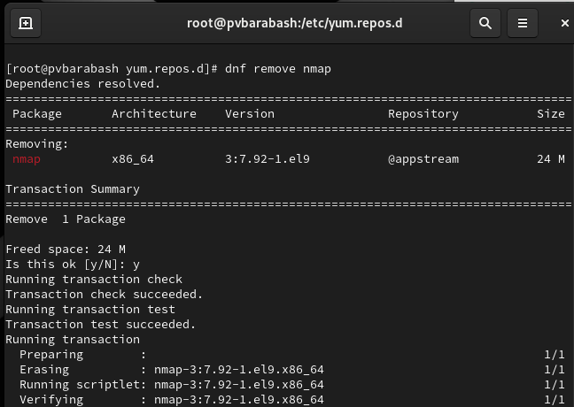
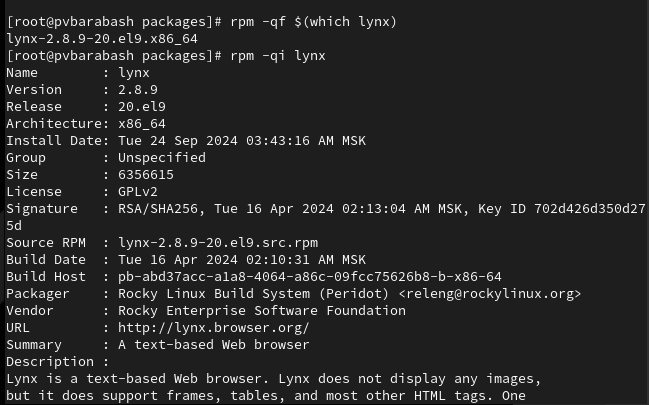
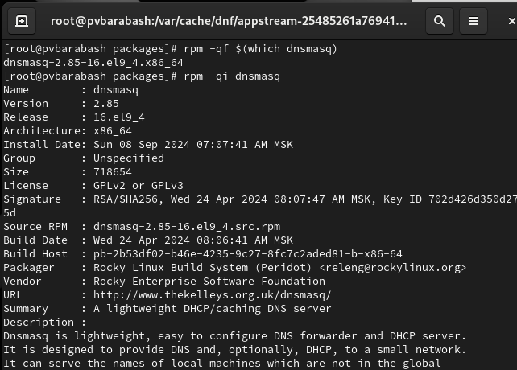

---
## Front matter
title: "Отчет по выполнению лабораторной работы"
subtitle: "Лабораторная работа №4"
author: "Полина Витальевна Барабаш"

## Generic otions
lang: ru-RU
toc-title: "Содержание"

## Pdf output format
toc: true # Table of contents
toc-depth: 2
lof: true # List of figures
lot: true # List of tables
fontsize: 12pt
linestretch: 1.5
papersize: a4
documentclass: scrreprt
## I18n polyglossia
polyglossia-lang:
  name: russian
  options:
	- spelling=modern
	- babelshorthands=true
polyglossia-otherlangs:
  name: english
## I18n babel
babel-lang: russian
babel-otherlangs: english
## Fonts
mainfont: PT Serif
romanfont: PT Serif
sansfont: PT Sans
monofont: PT Mono
mainfontoptions: Ligatures=TeX
romanfontoptions: Ligatures=TeX
sansfontoptions: Ligatures=TeX,Scale=MatchLowercase
monofontoptions: Scale=MatchLowercase,Scale=0.9
## Biblatex
biblatex: true
biblio-style: "gost-numeric"
biblatexoptions:
  - parentracker=true
  - backend=biber
  - hyperref=auto
  - language=auto
  - autolang=other*
  - citestyle=gost-numeric
## Pandoc-crossref LaTeX customization
figureTitle: "Рис."
tableTitle: "Таблица"
listingTitle: "Листинг"
lofTitle: "Список иллюстраций"
lolTitle: "Листинги"
## Misc options
indent: true
header-includes:
  - \usepackage{indentfirst}
  - \usepackage{float} # keep figures where there are in the text
  - \floatplacement{figure}{H} # keep figures where there are in the text
---

# Цель работы

Получить навыки работы с репозиториями и менеджерами пакетов.

# Выполнение лабораторной работы

**Задание 1.** В консоли перейдите в режим работы суперпользователя (используйте команду su -).

Я перешла в режим работы суперпользователя, использовав команду su - (рис. [-@fig:001]).

{#fig:001 width=70%}

**Задание 2.** Перейдите в каталог /etc/yum.repos.d и изучите содержание каталога и файлов репозиториев.

Я ввела команду cd /etc/yum.repos.d, чтобы перейти в нужный каталог и затем ввела команду ls, чтобы вывести названия репозиториев, затем я вводила команду cat название_репозитория.repo и изучала информацию в файлах (рис. [-@fig:002]), (рис. [-@fig:003]), (рис. [-@fig:004]), (рис. [-@fig:005]).

{#fig:002 width=70%}

{#fig:003 width=70%}

{#fig:004 width=70%}

{#fig:005 width=70%}

**Задание 3.** Выведите на экран список репозиториев.

Я использовала команду dnf repolist, чтобы вывести список репозиториев (рис. [-@fig:006]).

{#fig:006 width=70%}

**Задание 4.** Выведите на экран список пакетов, в названии или описании которых есть слово user.

Я использовала команду dnf search user, чтобы вывести на экран список пакетов, в названии или описании которых есть слово user (рис. [-@fig:007]).

{#fig:007 width=70%}

**Задание 5.** Установите nmap, предварительно изучив информацию по имеющимся пакетам.

Я убедилась, что пакет nmap существует, найдя его с помощью команды dnf search nmap (рис. [-@fig:008]).

{#fig:008 width=70%}

Затем я ввела команду dnf info nmap, чтобы вывести информацию об этом пакете (рис. [-@fig:009]).

{#fig:009 width=70%}

После этого я установила пакет nmap с помощью команды dnf install nmap (рис. [-@fig:010]).

{#fig:010 width=70%}

А затем также установила все пакеты, которые начинаются с nmap с помощью команды dnf install nmap\* (рис. [-@fig:011]).

{#fig:011 width=70%}

**Задание 6.** Удалите nmap.

Я удалила nmap и любые приложения, начинающиеся с nmap с помощью команд dnf remove nmap и dnf remove nmap\* (рис. [-@fig:012]) и (рис. [-@fig:013]).

{#fig:012 width=70%}

{#fig:013 width=70%}

**Задание 7.** Получите список имеющихся групп пакетов, затем установите группу пакетов RPM Development Tools.

Я вывела список имеющихся групп пакетов с помощью команды dnf groups list (рис. [-@fig:014]).

{#fig:014 width=70%}

Затем я вывела информацию о необходимой группе пакетов с помощью команды dnf groups info "RPM Development Tools" (рис. [-@fig:015]).

{#fig:015 width=70%}

И после этого я установила эту группу пакетов с помощью команды dnf groupinstall "RPM Development Tools" (рис. [-@fig:016]).

{#fig:016 width=70%}

**Задание 8.** Удалите группу пакетов RPM Development Tools.

Я использовала команду dnf groupremove "RPM Development Tools", чтобы удалить нужную группу пакетов (рис. [-@fig:017]).

{#fig:017 width=70%}

**Задание 9.** Посмотрите историю использования команды dnf.

Я посмотрела историю использования команды dnf с помощью команды dnf history (рис. [-@fig:018]).

{#fig:018 width=70%}

**Задание 10.** Отмените последнее действие.

Я использовала команду dnf history undo 6 (так как последнее действие номер 6) (рис. [-@fig:019]).

{#fig:019 width=70%}

**Задание 11.** Скачайте rpm-пакет lynx.

Сначала я убедилась, что пакет lynx есть в системе, использовав команду dnf list lynx, а затем я скачала rpm-пакет lynx с помощью команды dnf install lynx --downloadonly (рис. [-@fig:020]).

{#fig:020 width=70%}

**Задание 12.** Найдите каталог, в который был помещён пакет после загрузки.

Я выполнила команду find /var/cache/dnf/ -name lynx*, которая позволила найти каталог, в который был помещён пакет после загрузки (рис. [-@fig:021])

{#fig:021 width=70%}

**Задание 13.** Перейдите в этот каталог и затем установите rpm-пакет.

Я перешла в нужный каталог с помощью команды cd, а затем установила rpm-пакет с помощью команды rpm -Uhv lynx-<версия>.rpm (рис. [-@fig:022]).

{#fig:022 width=70%}

**Задание 14.** Определите расположение исполняемого файла.
 
С помощью команды which lynx я определила расположение исполняемого файла (рис. [-@fig:023]).

{#fig:023 width=70%}

**Задание 15.** Используя rpm, определите по имени файла, к какому пакету принадлежит lynx и получите дополнительную информацию о содержимом пакета.

Я использовала команду rpm -qf $(which lynx), чтобы определить по имени файла, к какому пакету принадлежит lynx, а затем получила дополнительную информацию о содержимом пакета с помощью команды rpm -qi lynx (рис. [-@fig:024]).

{#fig:024 width=70%}

**Задание 16.** Получите список всех файлов в пакете.

Я использовала команду rpm -ql lynx, чтобы получить список всех файлов пакета (рис. [-@fig:025]).

{#fig:025 width=70%}

**Задание 17.** Выведите перечень файлов с документацией пакета.

Я использовала команду rpm -qd lynx, чтобы получить список файлов с документацией пакета (рис. [-@fig:026]).

{#fig:026 width=70%}

**Задание 18.** Посмотрите файлы документации, применив команду man lynx.

Я использовала команду man lynx, чтобы посмотреть файлы документации (рис. [-@fig:027]).

{#fig:027 width=70%}

**Задание 19.** Выведите на экран перечень и месторасположение конфигурационных файлов пакета.

Я использовала команду rpm -qc lynx, чтобы вывести на экран перечень и месторасположение конфигурационных файлов пакета (рис. [-@fig:028]).

{#fig:028 width=70%}

**Задание 20.** Выведите на экран расположение и содержание скриптов, выполняемых при установке пакета.

Я использовала команду rpm -q --scripts lynx, чтобы вывести на экран расположение и содержание скриптов, выполняемых при установке пакета (рис. [-@fig:029]).

{#fig:029 width=70%}

Как можно видеть, у этого пакета нет скриптов.

**Задание 21.** В отдельном терминале под своей учётной записью запустите текстовый браузер lynx, чтобы проверить корректность установки пакета.

В отдельном терминале под своей учётной записью я запустила текстовый браузер lynx, чтобы проверить корректность установки пакета (рис. [-@fig:030]).

{#fig:030 width=70%}

**Задание 22.** Вернитесь в терминал с учётной записью root и удалите пакет.

Я вернулась в терминал с учетной записью root и удалила пакет с помощью команды rpm -e lynx и проверила, что он был удален, выведя список файлов с помощью команды ls (рис. [-@fig:031]).

{#fig:031 width=70%}

**Задание 23.** Установите пакет dnsmasq.

Сначала я нашла этот пакет с помощью команды dnf list dnsmasq, затем установила с помощью команды dnf install dnsmasq и узнала месторасположение исполняемого файла с помощью which dnsmasq (рис. [-@fig:032]).

{#fig:032 width=70%}

**Задание 24.** Определите по имени файла, к какому пакету принадлежит dnsmasq, и получите дополнительную информацию о содержимом пакета.

Я определила по имени файла, к какому пакету принадлежит dnsmasq, с помощью команды rpm -qf $(which dnsmasq), а затем я получила дополнительную информацию о содержимом пакета с помощью команды rpm -qi dnsmasq (рис. [-@fig:033]).

{#fig:033 width=70%}

**Задание 25.** Получите список всех файлов в пакете.

Я использовала команду rpm -ql dnsmasq, чтобы получить список всех файлов в пакете (рис. [-@fig:034]).

{#fig:034 width=70%}

**Задание 26.** Выведите перечень файлов с документацией пакета и посмотрите файлы документации, применив команду man dnsmasq.

Я вывела список файлов с документацией пакета и посмотрела файлы документации, применив команду man dnsmasq (рис. [-@fig:035]).

{#fig:035 width=70%}

**Задание 27.** Выведите на экран перечень и месторасположение конфигурационных файлов пакета.

Я вывела на экран перечень и месторасположение конфигурационных файлов пакета с помощью команды rpm -qc dnsmasq (рис. [-@fig:036]).

{#fig:036 width=70%}

**Задание 28.** Выведите на экран расположение и содержание скриптов, выполняемых при установке пакета.

Я вывела на экран расположение и содержание скриптов, выполняемых при установке пакета, с помощью команды rpm -q --scripts dnsmasq (рис. [-@fig:037]).

{#fig:037 width=70%}

**Задание 29.** Удалите пакет.

Я удалила пакет с помощью команды rpm -e dnsmask (рис. [-@fig:038]).

{#fig:038 width=70%}

# Ответы на контрольные вопросы

1. Какая команда позволяет вам искать пакет rpm, содержащий файл useradd?
Команда rpm -qf $(which useradd).
2. Какие команды вам нужно использовать, чтобы показать имя группы dnf, которая содержит инструменты безопасности и показывает, что находится в этой группе?
Команда dnf groupinfo "Security Tools".
3. Какая команда позволяет вам установить rpm, который вы загрузили из Интернета и который не находится в репозиториях?
Команда rpm -ivh имя_пакета.rpm.
4. Вы хотите убедиться, что пакет rpm, который вы загрузили, не содержит никакого опасного кода сценария. Какая команда позволяет это сделать?
Команда rpm --checksig имя_пакета.rpm.
5. Какая команда показывает всю документацию в rpm?
Команда rpm -qd имя_пакета.
6. Какая команда показывает, какому пакету rpm принадлежит файл?
Команда rpm -qf /путь/к/файлу.

# Выводы

Я получила навыки работы с репозиториями и менеджерами пакетов.
