---
## Front matter
title: "Отчет по выполнению лабораторной работы"
subtitle: "Лабораторная работа №5"
author: "Полина Витальевна Барабаш"

## Generic otions
lang: ru-RU
toc-title: "Содержание"

## Pdf output format
toc: true # Table of contents
toc-depth: 2
lof: true # List of figures
lot: true # List of tables
fontsize: 12pt
linestretch: 1.5
papersize: a4
documentclass: scrreprt
## I18n polyglossia
polyglossia-lang:
  name: russian
  options:
	- spelling=modern
	- babelshorthands=true
polyglossia-otherlangs:
  name: english
## I18n babel
babel-lang: russian
babel-otherlangs: english
## Fonts
mainfont: PT Serif
romanfont: PT Serif
sansfont: PT Sans
monofont: PT Mono
mainfontoptions: Ligatures=TeX
romanfontoptions: Ligatures=TeX
sansfontoptions: Ligatures=TeX,Scale=MatchLowercase
monofontoptions: Scale=MatchLowercase,Scale=0.9
## Biblatex
biblatex: true
biblio-style: "gost-numeric"
biblatexoptions:
  - parentracker=true
  - backend=biber
  - hyperref=auto
  - language=auto
  - autolang=other*
  - citestyle=gost-numeric
## Pandoc-crossref LaTeX customization
figureTitle: "Рис."
tableTitle: "Таблица"
listingTitle: "Листинг"
lofTitle: "Список иллюстраций"
lolTitle: "Листинги"
## Misc options
indent: true
header-includes:
  - \usepackage{indentfirst}
  - \usepackage{float} # keep figures where there are in the text
  - \floatplacement{figure}{H} # keep figures where there are in the text
---

# Цель работы

Получить навыки управления системными службами операционной системы посредством systemd.

# Выполнение лабораторной работы

**Задание 1.** Получите полномочия администратора.

Я перешла в режим работы суперпользователя, использовав команду su - (рис. [-@fig:001]).

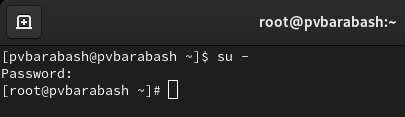{#fig:001 width=70%}

**Задание 2.** Проверьте статус службы Very Secure FTP.

Я ввела команду systemctl status vsftpd, чтобы проверить статус службы Very Secure FTP (рис. [-@fig:002]).

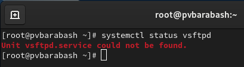{#fig:002 width=70%}

Вывод команды показал, что сервис в настоящее время отключён, так как служба Very Secure FTP не установлена.

**Задание 3.** Установите службу Very Secure FTP.

Я использовала команду dnf -y install vsftpd, чтобы установить службу Very Secure FTP (рис. [-@fig:003]).

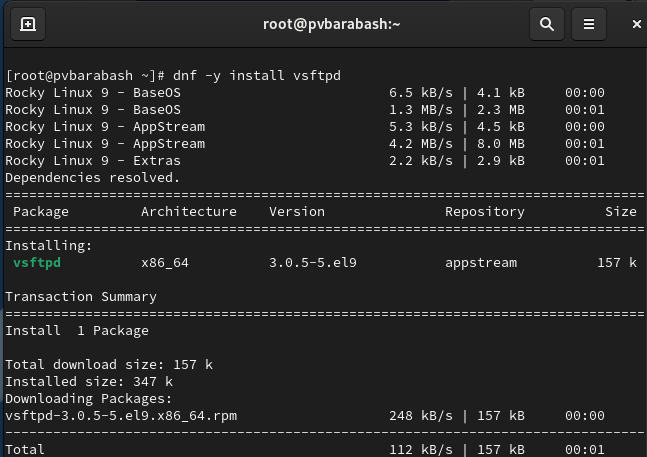{#fig:003 width=70%}

**Задание 4.** Запустите службу Very Secure FTP. Проверьте статус службы.

Я использовала команду systemctl start vsftpd, чтобы запустить службу Very Secure FTP. Затем я снова проверила статус службы, как можно видеть, служба в настоящее время работает, но не будет активирована при перезапуске операционной системы (рис. [-@fig:004]).

{#fig:004 width=70%}

**Задание 5.** Добавьте службу Very Secure FTP в автозапуск при загрузке операционной системы, используя команду systemctl enable. Затем проверьте статус службы. Удалите службу из автозапуска, используя команду systemctl disable, и снова проверьте её статус.

Я использовала команду systemctl enable vsftpd, чтобы добавить службу в автозапуск, а затем проверила статус службы, как можно видеть, в информации приводится enabled (рис. [-@fig:005]).

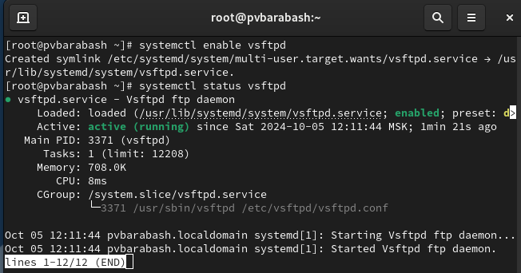{#fig:005 width=70%}

Затем я удалила службу из автозапуска, используя команду systemctl disable vsftpd и вновь проверила статус, снова в информации disabled (рис. [-@fig:006]).

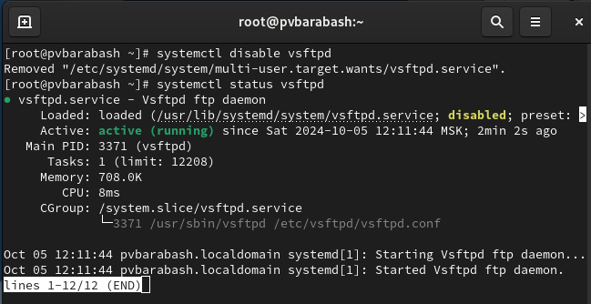{#fig:006 width=70%}

**Задание 6.** Выведите на экран символические ссылки, ответственные за запуск различных сервисов.

Я использовала команду ls /etc/systemd/system/multi-user.target.wants, чтобы вывести на экран символические ссылки, ответственные за запуск различных сервисов (рис. [-@fig:007]).

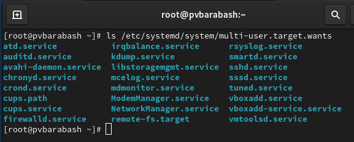{#fig:007 width=70%}

Как можно видеть, ссылки на vsftpd.service не существует.

**Задание 7.** Снова добавьте службу Very Secure FTP в автозапуск. Выведите на экран символические ссылки, ответственные за запуск различных сервисов.

Я снова добавила службу Very Secure FTP в автозапуск, используя команду systemctl enable vsftpd. А затем ввела команду из предыдущего задания, чтобы вывести на экран символические ссылки, ответственные за запуск различных сервисов (рис. [-@fig:008]).

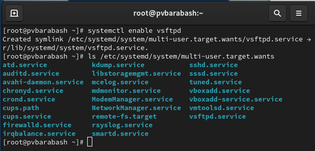{#fig:008 width=70%}

Как можно видеть, файл vsftpd.service появился.

**Задание 8.** Снова проверьте статус службы Very Secure FTP.

Я снова проверила статус службы Very Secure FTP (рис. [-@fig:009]).

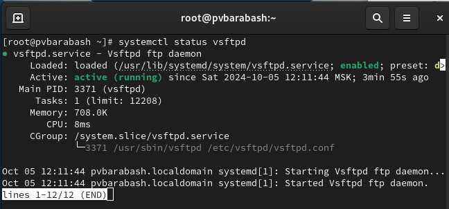{#fig:009 width=70%}

Можно видеть, что для файла юнита состояние изменено с disabled на enabled.

**Задание 9.** Выведите на экран список зависимостей юнита.

Я использовала команду systemctl list-dependencies vsftpd, чтобы вывести на экран список зависимостей юнита (рис. [-@fig:010]).

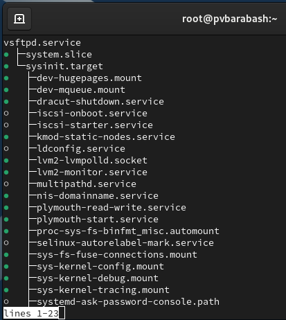{#fig:010 width=70%}

**Задание 10.** Выведите на экран список юнитов, которые зависят от данного юнита.

Затем я использовала команду systemctl list-dependencies vsftpd --reverse, чтобы вывести на экран список юнитов, которые зависят от данного юнита (рис. [-@fig:011]).

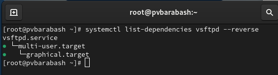{#fig:011 width=70%}

**Задание 11.** Установите iptables.

Я использовала команду dnf -y install iptables\*, чтобы установить iptables (рис. [-@fig:012]).

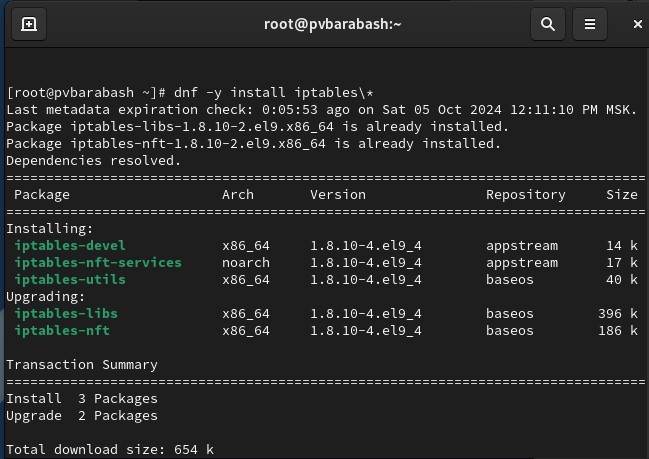{#fig:012 width=70%}

**Задание 12.** Проверьте статус firewalld и iptables.

Я использовала команды systemctl status firewalld и systemctl status iptables, чтобы проверить статус firewalld и iptables (рис. [-@fig:013]).

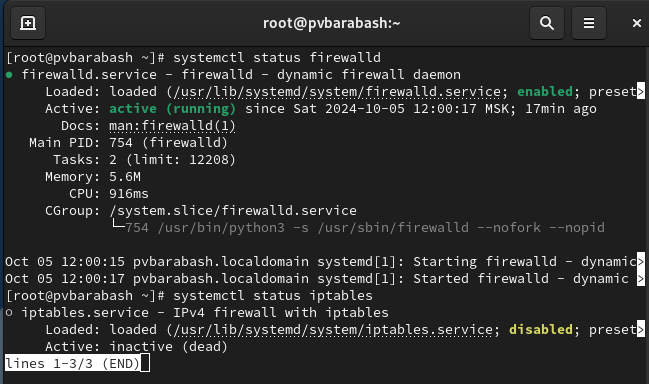{#fig:013 width=70%}

**Задание 13.** Попробуйте запустить firewalld и iptables.

Я выполнила команды systemctl start firewalld и systemctl start iptables, а затем опять проверила статус firewalld и iptables, как можно видеть, теперь firewalld неактивна, а iptables, которую мы запускали позже активна (рис. [-@fig:014]).

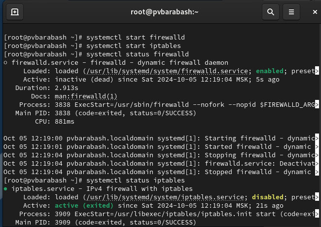{#fig:014 width=70%}

**Задание 14.** Введите cat /usr/lib/systemd/system/firewalld.service и опишите настройки конфликтов для этого юнита при наличии.

Я ввела нужную команду и увидела следующие настройки конфликтов: iptables.service, ip6tables.service, ebtables.service, ipset.service, nfables.service (рис. [-@fig:015]).

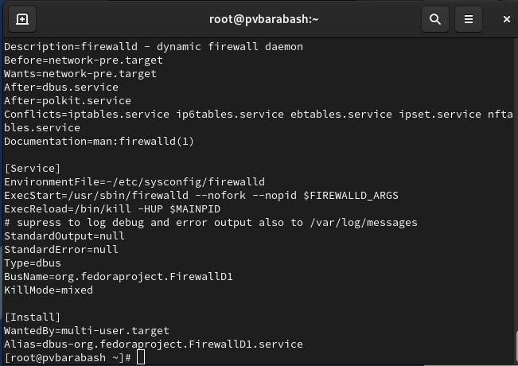{#fig:015 width=70%}

**Задание 15.** Введите cat /usr/lib/systemd/system/iptables.service и опишите настройки конфликтов для этого юнита.

Я ввела нужную команду, в данном случае строки о конфликтах нет (рис. [-@fig:016]).

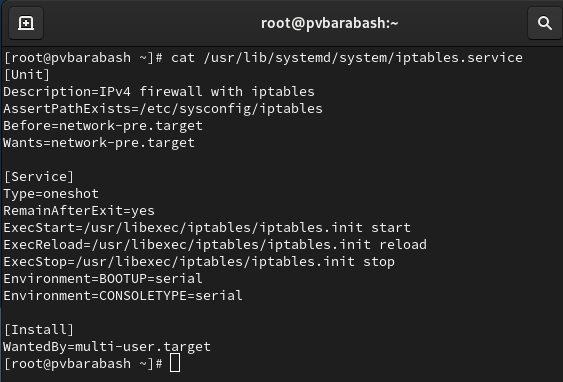{#fig:016 width=70%}

**Задание 16.** Выгрузите службу iptables (на всякий случай, чтобы убедиться, что данная служба не загружена в систему) и загрузите службу firewalld.

Я использовала команду systemctl stop iptables, чтобы выгрузить службу iptables, а затем использовала команду systemctl start firewalld, чтобы загрузить службу firewalld (рис. [-@fig:017]).

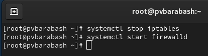{#fig:017 width=70%}

**Задание 17.** Заблокируйте запуск iptables. Попробуйте запустить iptables.

Я использовала команду systemctl mask iptables, чтобы заблокировать запуск iptables. Затем я попробовала запустить iptables, используя команду systemctl start iptables и получила сообщение о невозможности, так как запуск заблокирован (рис. [-@fig:018]).

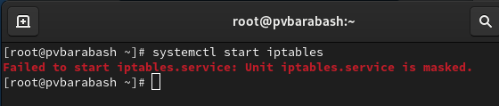{#fig:018 width=70%}

**Задание 18.** Попробуйте добавить iptables в автозапуск.

Я использовала команду systemctl enable iptables, чтобы попробовать добавить iptables в автозапуск (рис. [-@fig:019]).

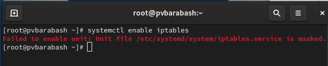{#fig:019 width=70%}

Как можно видеть, мы снова получили сообщение о невозможности этого действия.

**Задание 19.** Перейдите в каталог systemd и найдите список всех целей, которые можно изолировать.

Я перешла в каталог /usr/lib/systemd/system с помощью команды cd, а затем выполнила команду grep Isolate *.target, чтобы получить список всех целей, которые можно изолировать (рис. [-@fig:020]).

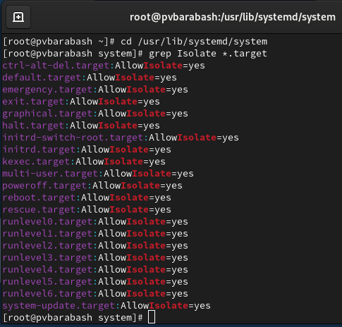{#fig:020 width=70%}

**Задание 20.** Переключите операционную систему в режим восстановления. Перезапустите операционную систему следующим образом systemctl isolate reboot.target.

Я выполнила команду systemctl isolate rescue.target, чтобы перейти в режим восстановления, появился черный экран и мне было предложено ввести пароль пользователя, я ввела его, а затем ввела команду systemctl isolate reboot.target и операционная система перезагрузилась.

**Задание 21.** Выведите на экран цель, установленную по умолчанию.

Я ввела команду systemctl get-default, чтобы вывести на экран цель, установленную по умолчанию (рис. [-@fig:021])

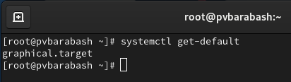{#fig:021 width=70%}

**Задание 22.** Для запуска по умолчанию текстового режима введите systemctl set-default multi-user.target. Перегрузите систему командой reboot. Убедитесь, что система загрузилась в текстовом режиме. Получите полномочия администратора. Для запуска по умолчанию графического режима введите systemctl set-default graphical.target. Вновь перегрузите систему командой reboot. Убедитесь, что система загрузилась в графическом режиме.

Я выполнила команду systemctl set-default multi-user.target, чтобы по умолчанию запускался текстовый режим (рис. [-@fig:022]).

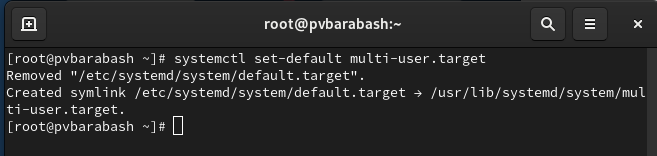{#fig:022 width=70%}

Затем я перезагрузила систему командой reboot. Система загрузилась в текстовом режиме, я получила полномочия администратора и для запуска по умолчанию графического режима ввела systemctl set-default graphical.target (рис. [-@fig:023]).

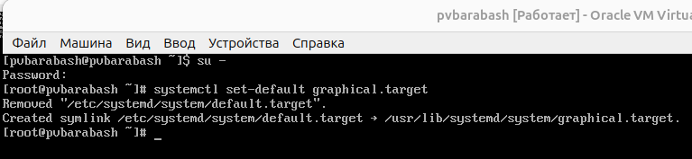{#fig:023 width=70%}

Затем я снова перезагрузила систему с помощью reboot и система загрузилась в графическом режиме.

# Ответы на контрольные вопросы

1. Что такое юнит (unit)? Приведите примеры.
Юнит (unit) — это основной объект управления в системе инициализации systemd. Юниты могут представлять собой различные ресурсы, такие как службы, цели, таймеры, сокеты и т.д. 
Примеры юнитов:
   - Служба (service): httpd.service — служба веб-сервера Apache.
   - Цель (target): multi-user.target — цель для многопользовательского режима.
   - Таймер (timer): my-timer.timer — пользовательский таймер для запуска задачи.
2. Какая команда позволяет вам убедиться, что цель больше не входит в список автоматического запуска при загрузке системы?
Нужно использовать команду systemctl disable <имя_цели>.
3. Какую команду вы должны использовать для отображения всех сервисных юнитов, которые в настоящее время загружены?
Нужно использовать команду systemctl list-units --type=service.
4. Как создать потребность (wants) в сервисе?
Чтобы создать потребность (wants) в сервисе, необходимо создать или изменить файл юнита и добавить следующую строку в секцию [Install]: Wants=<имя_сервиса>
Затем выполнить команду для активации юнита: systemctl enable <имя_юнита>
5. Как переключить текущее состояние на цель восстановления (rescue target)?
Использовать команду systemctl isolate rescue.target
6. Поясните причину получения сообщения о том, что цель не может быть изолирована.
Сообщение о том, что цель не может быть изолирована, может возникнуть, если цель имеет зависимости или если она не может быть активирована из-за текущего состояния системы (например, если другие юниты требуют ее активного состояния).
7. Вы хотите отключить службу systemd, но, прежде чем сделать это, вы хотите узнать, какие другие юниты зависят от этой службы. Какую команду вы бы использовали?
Я бы использовала команду systemctl list-dependencies systemd.

# Выводы

Я получила навыки управления системными службами операционной системы посредством systemd.
