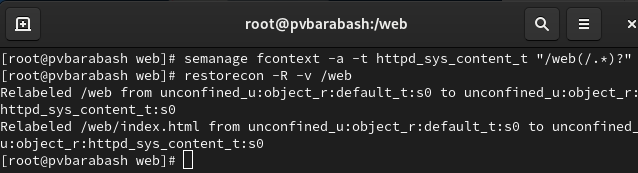

---
## Front matter
title: "Отчет по выполнению лабораторной работы"
subtitle: "Лабораторная работа №9"
author: "Полина Витальевна Барабаш"

## Generic otions
lang: ru-RU
toc-title: "Содержание"

## Pdf output format
toc: true # Table of contents
toc-depth: 2
lof: true # List of figures
lot: true # List of tables
fontsize: 12pt
linestretch: 1.5
papersize: a4
documentclass: scrreprt
## I18n polyglossia
polyglossia-lang:
  name: russian
  options:
	- spelling=modern
	- babelshorthands=true
polyglossia-otherlangs:
  name: english
## I18n babel
babel-lang: russian
babel-otherlangs: english
## Fonts
mainfont: PT Serif
romanfont: PT Serif
sansfont: PT Sans
monofont: PT Mono
mainfontoptions: Ligatures=TeX
romanfontoptions: Ligatures=TeX
sansfontoptions: Ligatures=TeX,Scale=MatchLowercase
monofontoptions: Scale=MatchLowercase,Scale=0.9
## Biblatex
biblatex: true
biblio-style: "gost-numeric"
biblatexoptions:
  - parentracker=true
  - backend=biber
  - hyperref=auto
  - language=auto
  - autolang=other*
  - citestyle=gost-numeric
## Pandoc-crossref LaTeX customization
figureTitle: "Рис."
tableTitle: "Таблица"
listingTitle: "Листинг"
lofTitle: "Список иллюстраций"
lolTitle: "Листинги"
## Misc options
indent: true
header-includes:
  - \usepackage{indentfirst}
  - \usepackage{float} # keep figures where there are in the text
  - \floatplacement{figure}{H} # keep figures where there are in the text
---

# Цель работы

Получить навыки работы с контекстом безопасности и политиками SELinux.

# Выполнение лабораторной работы

**Задание 1.** Получите полномочия администратора.

Я перешла в режим работы суперпользователя, использовав команду su - (рис. [-@fig:001]).

{#fig:001 width=70%}

**Задание 2.** Просмотрите текущую информацию о состоянии SELinux.

Я ввела команду sestatus -v, чтобы посмотреть текущую информацию о состоянии SELinux (рис. [-@fig:002]).

{#fig:002 width=70%}

**SELinux status**: показывает, включен ли SeLinux. Значение может быть "enabled" (включен) или "disabled" (выключен).
**SELinux mount**: указывает, где смонтирована файловая система SELinux.
**SELinux root directory**: путь к корневому каталогу конфигурации SELinux.
**Loaded policy name**: название загруженной политики безопасности. 
**Current mode**: текущий режим работы SELinux. В данном случае "enforcing", что означает, что политики SELinux применяются. Также могут быть значения "permissive" и "disabled".
**Mode from config file**: режим, указанных в конфигурационном файле SELinux. Это значение может совпадать с текущим режимом или отличаться.
**Policy MLS status**: статус поддержки многоуровневой безопасности (MLS). Может быть "enabled" или "disabled".
**Policy deny_unknown status**: указывает, разрешено ли отклонение неизвестных типов объектов. Значение может быть "allowed" или "denied".
**Max kernel policy version**: максимальная версия политики ядра, которая поддерживается системой.

**Задание 3.** Посмотрите, в каком режиме работает SELinux.

Я использовала команду getenforce, чтобы посмотреть, в каком режиме работает SELinux (рис. [-@fig:003]).

{#fig:003 width=70%}

Как можно видеть на скриншоте, SELinux находится в режиме принудительного исполнения (Enforcing).

**Задание 4.** Измените режим работы SELinux на разрешающий (Permissive) и снова проверьте, в каком режиме работает SELinux.

Я изменила режим работы SELinux на разрешающий с помощью команды setenforce 0 и снова ввела команду getenforce (рис. [-@fig:004]).

{#fig:004 width=70%}

Как можно видеть, режим работы действительно изменился на необходимый.

**Задание 5.** В файле /etc/sysconfig/selinux с помощью редактора установите SELINUX=disabled. Перезагрузите систему.

Я использовала редактор vim, чтобы изменить файл (рис. [-@fig:005]).

{#fig:005 width=70%}

Затем я перезапустила систему с помощью команды reboot.

**Задание 6.** После перезагрузки запустите терминал и получите полномочия администратора. Посмотрите статус SELinux.

После перезагрузки я  запустила терминал и получила полномочия администратора. Затем я посмотрела статус SELinux с помощью всё той же команды getenforce (рис. [-@fig:006]).

{#fig:006 width=70%}

Действительно, статус изменен на disabled.

**Задание 7.** Попробуйте переключить режим работы SELinux.

Я использовала команду setenforce 1, но получила сообщение, что SELinux is disabled (рис. [-@fig:007]).

{#fig:007 width=70%}

**Задание 8.** Откройте файл /etc/sysconfig/selinux с помощью редактора и установите: SELINUX=enforcing. Перезагрузите систему.

Я снова открыла файл в редакторе vim и изменила настройки на enforcing (рис. [-@fig:008]).

{#fig:008 width=70%}

Затем я перезагрузила систему.

**Задание 9.** После перезагрузки в терминале с полномочиями администратора просмотрите текущую информацию о состоянии SELinux.

Я снова получила полномочия администратора и посмотрела текущую информацию о состоянии SELinux с помощью команды sestatus -v (рис. [-@fig:009]).

{#fig:009 width=70%}

Я убедилась, что система работает в принудительном режиме (enforcing) использования SELinux.

**Задание 10.** Запустите терминал и получите полномочия администратора. Посмотрите контекст безопасности файла /etc/hosts.

Я использовала команду ls -Z /etc/hosts и увидела, что у файла есть метка контекста net_conf_t (рис. [-@fig:010]).

{#fig:010 width=70%}

**Задание 11.** Скопируйте файл /etc/hosts в домашний каталог. Проверьте контекст файла ~/hosts

Я скопировала файл /etc/hosts в домашний каталог с помощью команды cp. Затем я проверила контекст скопированного файла (рис. [-@fig:011]).

{#fig:011 width=70%}

Как можно видеть, у этого файла метка контекста стала admin_home_t.

**Задание 12.** Попытайтесь перезаписать существующий файл hosts из домашнего каталога в каталог /etc. И подтвердите, что вы хотите сделать это.

Я использовала команду mv ~/hosts /etc и подтвердила, что хочу переместить файл (рис. [-@fig:012]).

{#fig:012 width=70%}

**Задание 13.** Убедитесь, что тип контекста по-прежнему установлен на admin_home_t.

Я использовала команды ls -Z /etc/hosts и убедилась, что тип  контекста по-прежнему установлен на admin_home_t (рис. [-@fig:013]).

{#fig:013 width=70%}

**Задание 14.** Исправьте контекст безопасности.

Я выполнила команду restorecon -v /etc/hosts, чтобы исправить контекст безопасности (рис. [-@fig:014]).

{#fig:014 width=70%}

Благодаря опции -v, мы получили сообщение об исправлении.

**Задание 15.** Убедитесь, что тип контекста изменился.

Я вновь ввела команду ls -Z /etc/hosts и убедилась, что тип контекста изменился (рис. [-@fig:015]).

{#fig:015 width=70%}

**Задание 16.** Для массового исправления контекста безопасности на файловой системе введите touch /.autorelabel и перезагрузите систему. Во время перезапуска не забудьте нажать клавишу Esc на клавиатуре, чтобы вы видели загрузочные сообщения. Вы увидите, что файловая система автоматически перемаркирована.

Я ввела приведенную команду (рис. [-@fig:016]).

{#fig:016 width=70%}

Затем перезапустила систему. И при перезагрузке нажала Esc и действительно увидела, что файловая система перемаркировалась.

**Задание 17.** Получите права администратора. Установите необходимое программное обеспечение: dnf -y install httpd и dnf -y install lynx.

Я получила права администратора, а затем использовала обе приведенные команды, чтобы установить необходимое ПО (рис. [-@fig:017]) и (рис. [-@fig:018]).

{#fig:017 width=70%}

{#fig:018 width=70%}

**Задание 18.** Создайте новое хранилище для файлов web-сервера. Создайте файл index.html в каталоге с контентом веб-сервера.

Я создала каталог /web с помощью команды mkdir. Затем перешла в этот каталог с помощью команды cd и создала внутри файл index.html с помощью команды touch (рис. [-@fig:019]).

{#fig:019 width=70%}

**Задание 19.** Поместите в файл следующий текст: Welcome to my web-server.

Я открыла файл index.html в vim и добавила туда нужную фразу (рис. [-@fig:020]).

{#fig:020 width=70%}

**Задание 20.** В файле /etc/httpd/conf/httpd.conf закомментируйте строку DocumentRoot "/var/www/html" и ниже добавьте строку DocumentRoot "/web".

Я открыла файл /etc/httpd/conf/httpd.conf с помощью редактора vim, затем я закомментировала нужную строку и добавила данную (рис. [-@fig:021])

{#fig:021 width=70%}

**Задание 21.** Затем в этом же файле ниже закомментируйте раздел

<Directory "/var/www">
AllowOverride None
Require all granted
</Directory>

и добавьте следующий раздел, определяющий правила доступа:

<Directory "/web">
AllowOverride None
Require all granted
</Directory>

Все в том же открытом в vim файле я закомментировала нужный раздел и добавила данных (рис. [-@fig:022]).

{#fig:022 width=70%}

**Задание 22.** Запустите веб-сервер и службу httpd.

Я использовала команды systemctl start httpd и systemctl enable httpd, чтобы запустить веб-сервер и службу httpd (рис. [-@fig:023]).

{#fig:023 width=70%}

**Задание 23.** Запустите веб-сервер в текстовом браузере lynx.

Я запустила веб-сервер в текстовом браузере lynx с помощью команды lynx http://localhost (рис. [-@fig:024]).

{#fig:024 width=70%}

Я увидела веб-страницу Red Hat по умолчанию, а не содержимое только что созданного файла index.html.

**Задание 24.** В терминале с полномочиями администратора примените новую метку контекста к /web: semanage fcontext -a -t httpd_sys_content_t "/web(/.*)?". Восстановите контекст безопасности.

Я использовала приведенную команду, затем я использовала команду restorecon -R -v /web, чтобы восстановить контекст безопасности (рис. [-@fig:025]).

{#fig:025 width=70%}

**Задание 25.** Снова обратитесь к веб-серверу.

Я использовала команду lynx http://localhost, чтобы вновь открыть страницу в текстовом браузере (рис. [-@fig:026]).

{#fig:026 width=70%}

Теперь действительно появилась запись из нашего файла index.html.

**Задание 26.** Посмотрите список переключателей SELinux для службы ftp.

Я использовала команду getsebool -a | grep ftp, чтобы посмотреть список переключателей SELinux для службы ftp (рис. [-@fig:027]).

{#fig:027 width=70%}

Я увидела переключатель ftpd_anon_write с текущим значением off.

**Задание 27.** Для службы ftpd_anon посмотрите список переключателей с пояснением, за что отвечает каждый переключатель, включён он или выключен.

Я ввела команду semanage boolean -l | grep ftpd_anon, чтобы посмотреть список переключателей с пояснением (рис. [-@fig:028]).

{#fig:028 width=70%}

**Задание 28.** Измените текущее значение переключателя для службы ftpd_anon_write с off на on. Повторно посмотрите список переключателей SELinux для службы ftpd_anon_write.

Я использовала команду setsebool ftpd_anon_write on, чтобы изменить текущее значение переключателя для службы ftpd_anon_write с off на on. Затем я проверила командой getsebool ftpd_anon_write, что действительно текущее состояние переключателя изменилось (рис. [-@fig:029]).

{#fig:029 width=70%}

**Задание 29.** Посмотрите список переключателей с пояснением.

Я вновь посмотрела список переключателей с пояснением (рис. [-@fig:030]).

{#fig:030 width=70%}

Я обратила внимание, что настройка времени выполнения включена, но постоянная настройка по-прежнему отключена.

**Задание 30.** Измените постоянное значение переключателя для службы ftpd_anon_write с off на on. Посмотрите список переключателей.

Я ввела команду setsebool -P ftpd_anon_write on, чтобы изменить постоянное значение переключателя службы ftpd_anon_write с off на on. А затем посмотрела список переключателей (рис. [-@fig:031]).

{#fig:031 width=70%}

Теперь и текущее значение переключателя, и постоянное включено.

# Ответы на контрольные вопросы

1. Вы хотите временно поставить SELinux в разрешающем режиме. Какую команду вы используете?
Команду setenforce 0.
2. Вам нужен список всех доступных переключателей SELinux. Какую команду вы используете?
Команду getsebool -a.
3. Каково имя пакета, который требуется установить для получения легко читаемых сообщений журнала SELinux в журнале аудита?
Пакет называется policycoreutils.
4. Какие команды вам нужно выполнить, чтобы применить тип контекста httpd_sys_content_t к каталогу /web?
semanage fcontext -a -t httpd_sys_content_t "/web(/.*)?"
5. Какой файл вам нужно изменить, если вы хотите полностью отключить SELinux?
Файл конфигурации находится по пути: /etc/selinux/config. Нужно изменить параметр SELINUX= на disabled.
6. Где SELinux регистрирует все свои сообщения?
SELinux регистрирует свои сообщения в журнале /var/log/audit/audit.log и в системном журнале (/var/log/messages или /var/log/syslog в зависимости от дистрибутива).
7. Вы не знаете, какие типы контекстов доступны для службы ftp. Какая команда позволяет получить более конкретную информацию?
seinfo --type=ftp или sesearch --allow -s ftp_t -t
8. Ваш сервис работает не так, как ожидалось, и вы хотите узнать, связано ли это с SELinux или чем-то ещё. Какой самый простой способ узнать?
Ввести команду  ausearch -m avc -ts recent. Эта команда покажет последние сообщения AVC (Access Vector Cache), которые могут указать, блокирует ли SELinux доступ сервису.

# Выводы

Я получила навыки работы с контекстом безопасности и политиками SELinux.
